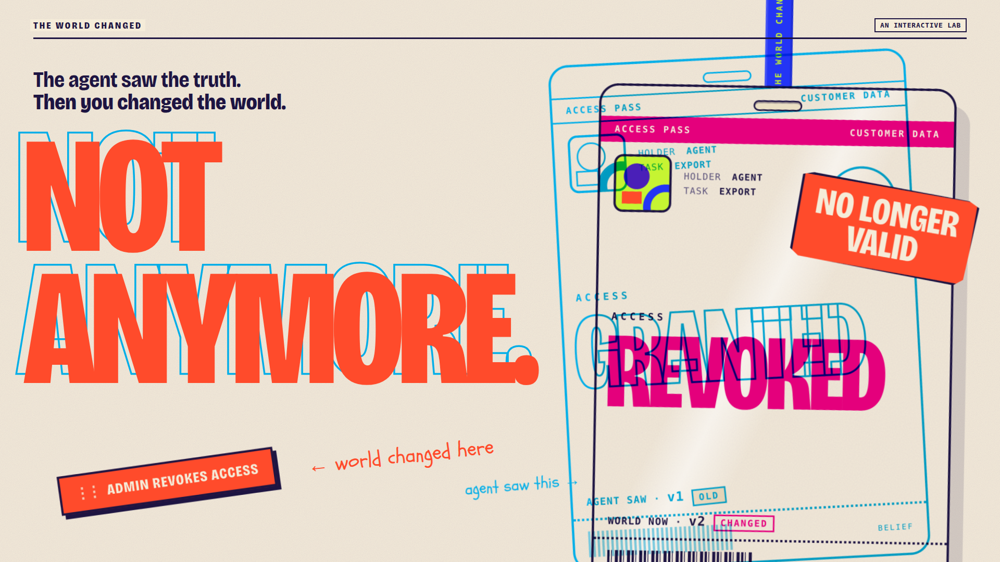

# THE WORLD CHANGED — case study

**An interactive lab where you change reality after an AI agent has observed it, then see whether the agent notices before it acts.**

Live Lab: https://the-world-changed-lab.pages.dev/ · Front door: https://the-world-changed.pages.dev/
Role: concept, interaction design, visual system, kernel, live-agent harness, packaging.

---

## Problem

**An agent can see something true and still be wrong when it acts.**

Nothing here is a hallucination. The agent reads the state correctly: access is granted, the slot is free,
this is the latest draft. Then it prepares, plans or waits. By the time it commits, the world may have moved.
The observation was accurate when it was made and is stale when it is used.

Engineers know this as stale state or time-of-check to time-of-use. Most people who will trust agents with
real actions have never seen it, and a diagram of it doesn't make them feel it.

## Insight

**The failure lives in the time between observation and action.**

So the interval itself should be the object on screen. Not a log or a trace waterfall. A physical gap you can
hold open.

## Interaction

**PULL THE GAP.**

The front door is one access pass and one perforated ticket: LOOK on the left, ACT on the right.

1. The pass says **ACCESS GRANTED**. The headline says **IT WAS TRUE.**
2. Drag ACT away from LOOK. The ticket tears open. Nothing else changes: an open gap on its own is not a problem.
3. Drop **ADMIN REVOKES ACCESS** into the tear. A cancellation sticker slams onto the pass. **NOT ANYMORE.**
4. What the agent saw lifts out of register as a cyan ghost: `AGENT SAW · v1 · OLD` over `WORLD NOW · v2 · CHANGED`.
5. Pull the pin. With **CHECK AGAIN** on, a scanner reads the current pass, the ghost snaps back into register and the action is **STOPPED**. With it off, the outdated pass reaches the (simulated) effect.

## Experiment

**The visitor becomes the changing world.**

After one outcome, a lime ticket appears: **CHANGE THE WORLD AGAIN · ENTER THE LAB →**. The pass slides off
the table and the Lab is underneath.

- **PICK A WORLD.** ACCESS, a CALENDAR slot, a DOCUMENT version. Same mechanic, different objects.
- **CHANGE IT.** The agent heads for ACT on its own. You have one move to change the world in time.
- **SAME WORLD, TWO OUTCOMES.** One mutation, split down the middle: without the check, with the check.
- **REPLAY WHAT THE AGENT SAW.** Scrub a finished run: what it saw → what it prepared → what the world became → what it checked / did.

## Proof

The interaction comes first; the proof sits one click behind it.

- **Deterministic kernel.** ACCESS runs on a seeded state machine. Every mutation bumps `world_version`, every
  observation records the version it saw, and receipts replay exactly (`4318ef42` unchecked, `39873635` checked).
- **Same-world comparison.** One world, one mutation, one policy difference. Unchecked: `UNAUTHORIZED_COMMIT`,
  reason `STALE_AUTHORITY`, a sandbox-only simulated effect. Checked: `BLOCKED`, no effect.
- **A genuine Claude Opus 5.5 specimen.** One run through the Claude Code SDK against four sandbox tools.
  It observed GRANTED, prepared the export, the world changed under it, it called `verify_access` on its own,
  saw REVOKED and stopped before commit. The public Lab replays that receipt and says so:
  **RECORDED GENUINE RUN · NOT RUNNING NOW**. One run is a specimen, not a rate.
- **Receipts, not chain-of-thought.** World events, tool calls, results, diffs. Private reasoning is not recorded or shown.

Full provenance: [`PROOF-APPENDIX.md`](PROOF-APPENDIX.md).

## Expansion

| Layer | What it adds |
|---|---|
| World Playground | the mechanic generalises beyond access: calendar slots, document versions (simulated worlds, labelled) |
| Challenge | timing becomes play: can you change the world before it acts? |
| Replay | every outcome can be reconstructed from its receipt, beat by beat |
| Live specimen | a real model, a real run, clearly marked as recorded; public live execution disabled because a static site has no secure executor |

Discovery is progressive: the Lab never appears until the visitor finishes one outcome, and four paper index
tabs (WORLD · CHANGE IT · REPLAY · LIVE) are the only navigation.

## Design system

The brief ruled out a dark AI dashboard. The references were a scientific instrument, a test bench and a
misregistered print run.

- **Physical credentials.** An access pass on a lanyard, a torn ticket, a paper calendar, a document stack.
  Things that can be valid, stamped, cancelled.
- **Paper.** Warm cream stock with grain. Deep violet ink, never pure black.
- **Stamps and stickers.** Coral for the world changing, lime for VALID, violet for STOPPED.
- **Misregistration.** Cyan is what the agent saw; magenta is what is true now. When they agree the plates
  are in register. When the world changes, the old plate lifts off.
- **Editorial typography.** Bricolage Grotesque at 75% width, set huge: the headline *is* the state
  (IT WAS TRUE. → NOT ANYMORE. → THE WORLD CHANGED.). Schoolbell for small handwritten annotations
  (*agent saw this*, *world changed here*, *check again*).
- **Motion with a job.** Gap width is time. The slam is the world changing. The ghost offset is staleness.
  The scanner sweep is the re-check. Snap-to-register is a refresh. No decorative motion.

Mouse, touch, keyboard and reduced motion all work, and meaning is never carried by colour alone.

## Validation

What is recorded in this repository:

- automated: kernel, receipts, replay, scenario adapters, same-world comparison, Challenge timing, live-receipt
  presentation, keyboard paths, reduced-motion state fidelity, live-tool isolation (see `PROOF-APPENDIX.md` §8);
- browser regressions that drive real gestures on desktop, touch and keyboard and assert kernel-driven DOM state;
- one genuine model run whose receipt passes the automated live-proof checks.

What is **not** recorded yet: first-time-viewer comprehension. The hero and Lab test protocols
(P01–P05) are written and ready; their result sheets are still empty. Until they are filled, this project makes no
claim about how quickly or how well people understand it.

## Novelty boundary

Stale state, TOCTOU, revalidation and commit-time authorization are not new ideas, and this project does not
claim they are. The contribution is the experience: a live agent, a world the visitor can mutate, a physical
observation→action gap, belief/reality misregistration, and reproducible proof, all in one interaction.
